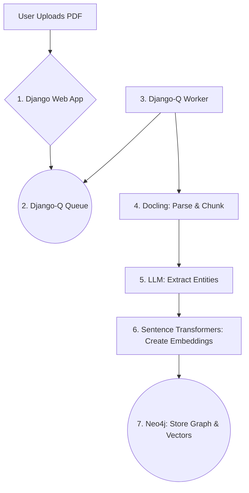

# Intelligent Document QA: An End-to-End RAG System with an AI Agent

This project implements a complete, full-stack, and production-ready system for performing Retrieval-Augmented Generation (RAG) on user-uploaded PDF documents. It features an asynchronous ingestion pipeline, a sophisticated hybrid retrieval strategy using a graph database, and a conversational AI agent capable of multi-tool use.

The application is fully containerized with Docker and Docker Compose, allowing any developer to set up and run the entire multi-service environment with a single command.

## 🌟 Key Features

-   **Asynchronous PDF Ingestion:** Upload any PDF through the web UI. The ingestion is handled by a **Django-Q** background worker, providing a non-blocking user experience.
-   **Advanced Document Parsing:** Utilizes **Docling** to intelligently parse PDFs, preserving layout and extracting text, tables, and metadata for high-quality chunking.
-   **Hybrid Retrieval Strategy:** Employs a state-of-the-art, two-stage retrieval process:
    1.  **Graph & Vector Search:** Leverages **Neo4j** as a multi-model database, performing both semantic vector similarity search and graph-based entity retrieval to find the most relevant document chunks.
    2.  **Re-ranking:** Uses a powerful **Cross-Encoder** model to re-rank the initial candidates for maximum relevance before sending them to the LLM.
-   **Conversational AI Agent:** Built with **LangChain**, the AI agent can reason, form multi-step plans, and use a suite of custom tools to answer complex queries. It can:
    -   List available documents.
    -   Answer specific questions about a single document with citations.
    -   Compare and contrast information across multiple documents.
-   **Full-Stack & Production-Ready:**
    -   **Backend:** Robust and scalable backend built with **Django**.
    -   **Containerized:** The entire multi-service application (Django, Neo4j, Django-Q Worker) is managed by **Docker Compose** for easy, one-command local setup.
    -   **Cloud-Ready:** While configured for local setup, the architecture is designed to be deployed to any cloud platform.

## 🏛️ Project Architecture

The application is architected with a clear separation of concerns, featuring an asynchronous ingestion pipeline and a powerful agentic query pipeline.

### Ingestion Pipeline (Asynchronous)



### Agentic Query Pipeline

```mermaid
graph TD
    subgraph User Interaction
        A[User sends message] --> B{1. Django Web App};
    end

    subgraph Agent Core
        B --> C{2. LangChain Agent Executor};
        C -- Thought --> D[3. LLM (Gemini)];
        D -- Plan --> C
        C -- Tool Call --> E[4. Custom Tools];
    end

    subgraph RAG Backend
        E -- (query_document) --> F{5. Hybrid Retrieval};
        F -- Graph & Vector Search --> G((Neo4j));
        G --> F;
        F -- Re-ranking --> H[6. Cross-Encoder];
        H --> I[7. Final Context];
        I --> J[8. LLM (Gemini)];
        J --> E;
    end
    
    E --> C;
    C -- Final Answer --> B;
```

## 🛠️ Tech Stack

-   **Backend:** Django
-   **Asynchronous Tasks:** Django-Q
-   **Database:** Neo4j (Graph & Vector Database)
-   **PDF Parsing:** Docling
-   **Embedding Model:** `sentence-transformers` (Bi-Encoder)
-   **Re-ranking Model:** `cross-encoder`
-   **LLM:** Google Gemini Pro
-   **Agent Framework:** LangChain
-   **Containerization:** Docker & Docker Compose

---

## 🚀 How to Run Locally (Using Docker Compose)

This project is designed to be run locally using Docker Compose, which simplifies the setup of the multi-service environment.

### Prerequisites
-   **Docker Desktop:** Ensure Docker Desktop is installed and running on your machine.
-   **Git:** For cloning the repository.

### Step 1: Clone the Repository
```bash
git clone https://github.com/YourUsername/Intelligent-Document-QA.git
cd Intelligent-Document-QA```

### Step 2: Configure Your Environment Secrets
The application requires API keys and database credentials.

1.  Navigate into the Django project folder:
    ```bash
    cd rag_webapp
    ```
2.  Create a new file named `.env`:
    ```bash
    touch .env
    ```
3.  Open the `.env` file and add your credentials. The values for `NEO4J_URI` and `CELERY_BROKER_URL` are specifically for the Docker Compose setup and should be copied exactly.

    ```.env
    # rag_webapp/.env

    # --- Neo4j Credentials for Docker Compose ---
    NEO4J_URI="neo4j://neo4j:7687"
    NEO4J_USER="neo4j"
    NEO4J_PASSWORD="your-strong-local-password" # Choose a strong password

    # --- Google Gemini API Key ---
    GEMINI_API_KEY="Your-Google-AI-Studio-API-Key"

    # --- Django-Q (Redis) Broker URL for Docker Compose ---
    CELERY_BROKER_URL="redis://redis:6379/0" 
    ```
4.  Navigate back to the project root directory:
    ```bash
    cd ..
    ```

### Step 3: Configure the Neo4j Password
You must ensure the password in your `.env` file matches the one used by the Neo4j container.

1.  Open the `docker-compose.yml` file in the project root.
2.  Find the `neo4j` service definition.
3.  Update the password in the `NEO4J_AUTH` environment variable to **exactly match** the `NEO4J_PASSWORD` you set in your `.env` file.

    ```yaml
    # docker-compose.yml
    services:
      neo4j:
        # ...
        environment:
          - NEO4J_AUTH=neo4j/your-strong-local-password # <-- MUST MATCH .env
    ```

### Step 4: Build and Run the Application
With Docker running, execute the following command from the **project root directory** (the one with `docker-compose.yml`). This single command will build your Django image and start all four services (Neo4j, Redis, Django, and the Django-Q worker).

```bash
docker-compose up --build
```

The initial build may take several minutes as it downloads the base images and installs all Python dependencies. Your terminal will fill with color-coded logs from all the services.

### Step 5: Access the Application
Once the services are running, your application is ready to use:

-   **🧠 Main Web Application:** Open your browser and go to **`http://localhost:8000`**
-   **🐘 Neo4j Database Browser:** To inspect the graph data, go to **`http://localhost:7474`**
    -   **Connect URI:** `bolt://localhost:7687`
    -   **Username:** `neo4j`
    -   **Password:** The password you set in the configuration files.

### Step 6: Stop the Application
To stop all running services, open a new terminal window, navigate to the project root, and run:
```bash
docker-compose down
```

---

## 📈 Future Scope
-   **Real-time Agent Feedback:** Implement WebSockets to stream the agent's "chain of thought" to the user interface in real-time.
-   **User Authentication:** Add user accounts to allow for private document collections.
-   **Enhanced Citations:** Use the bounding box data from Docling to visually highlight the source of an answer directly on a rendered PDF page.
