# Intelligent Document QA with RAG and Citations

This project implements a complete, end-to-end Retrieval-Augmented Generation (RAG) pipeline that allows users to upload their own PDF documents and ask questions based on the content. The system provides accurate answers along with citations, pointing to the specific page number from which the information was retrieved.

The application is built with a robust backend using Neo4j and Google Gemini, and served through a clean web interface powered by Django. It is containerized with Docker for easy and reliable deployment.

**[https://huggingface.co/spaces/NeelM47/my-rag-demo?logs=container]**

## Demo


*The demo shows a user uploading a new PDF, which is then processed and added to the document database. The user then selects the document, asks a specific question, and receives a generated answer that includes page number citations.*

---

## ✨ Features

- **Dynamic Document Ingestion:** Upload any PDF document through a simple web interface.
- **Automated Processing Pipeline:** Documents are automatically parsed, chunked, and vectorized using state-of-the-art models.
- **Graph & Vector Database:** Utilizes **Neo4j** to store both the document structure and its vector embeddings, enabling efficient and context-aware retrieval.
- **Accurate, Context-Aware Answers:** Leverages **Google's Gemini Pro** model to generate answers strictly based on the content retrieved from the document.
- **Source Citations:** Every answer is accompanied by the page number(s) of the source chunks, ensuring verifiability and trust.
- **Scalable Architecture:** Built with a professional Django backend and containerized with Docker for easy deployment and scaling.

---

## 🏗️ Tech Stack & Architecture

This project is built on a modern, AI-centric stack, separating the ingestion and querying pipelines for efficiency and clarity.

### Ingestion Pipeline
The ingestion pipeline is triggered when a user uploads a new PDF.

```mermaid
graph TD
    A[User Uploads PDF] --> B{Django Backend};
    B --> C[📄 Docling: Parse PDF];
    C --> D[✂️ Chunking Logic];
    D --> E[🧠 Sentence Transformers: Generate Embeddings];
    E --> F((🐘 Neo4j: Chunks & Embeddings));
```



### Query Pipeline
The query pipeline is triggered when a user asks a question.

```mermaid
graph TD
    subgraph User Interface
        A[User asks question] --> B{Django Backend};
    end
    subgraph RAG Core
        B --> C[🧠 Sentence Transformers: Embed Question];
        C --> D{Vector Search in Neo4j};
        D --> E[Retrieve Top-K Chunks];
        E --> F[🤖 Google Gemini LLM];
    end
    F --> G[✅ Answer with Citations];
    G --> B;
```



### Key Components
- **Backend Framework:** Django
- **Database:** Neo4j (AuraDB Cloud) for graph structure and vector search
- **PDF Parsing:** Docling
- **Embedding Model:** `all-MiniLM-L6-v2` via `sentence-transformers`
- **Large Language Model (LLM):** Google Gemini Pro
- **Deployment:** Docker & Hugging Face Spaces

---

## 🚀 Getting Started

Follow these instructions to set up and run the project locally.

### Prerequisites
- Python 3.10+
- Conda or another Python environment manager
- Docker Desktop (Optional, for running locally in a container)
- A running Neo4j instance (local or AuraDB)

### 1. Clone the Repository
```bash
git clone https://github.com/NeelM47/Knowledge-Extractor-RAG
cd Knowledge-Extractor-RAG
```

### 2. Set Up the Environment
```bash
# Create and activate a conda environment
conda create -n rag-citation python=3.10
conda activate rag-citation

# Install dependencies
pip install -r requirements.txt
```

### 3. Configure Environment Variables
Create a file named `.env` in the root of your project folder (`rag_final_project/`). This file will hold your secret keys.

```.env
# Neo4j Credentials (use your AuraDB instance details)
NEO4J_URI="neo4j+s://xxxxxx.databases.neo4j.io"
NEO4J_USER="neo4j"
NEO4J_PASSWORD="YourAuraDBPassword"

# Google Gemini API Key
GEMINI_API_KEY="YourGeminiAPIKey"
```
*Your Python code is set up to automatically load these variables.*

### 4. Run Django Migrations
This sets up the basic database tables that Django needs (this does not affect Neo4j).
```bash
python rag_webapp/manage.py migrate
```

### 5. Start the Server
```bash
python rag_webapp/manage.py runserver
```
The application will be available at **`http://127.0.0.1:8000/`**.

---

## ☁️ Deployment

This application is designed for containerized deployment using **Docker** and is hosted on **Hugging Face Spaces**.

- **Database:** A cloud-hosted **Neo4j AuraDB** instance is used for persistent storage, as Hugging Face Spaces have an ephemeral filesystem.
- **Containerization:** The `Dockerfile` defines the environment, installs all dependencies, and runs the application using a `gunicorn` production server.
- **Secrets Management:** All credentials (database password, API keys) are securely managed using Hugging Face's repository secrets, not hardcoded in the application.

This setup ensures that the application is portable, scalable, and secure.

---

## 🔮 Future Improvements

- **Asynchronous Ingestion:** For very large PDFs, the ingestion process could be moved to a background worker queue (using Celery & Redis) to prevent blocking the web server.
- **Enhanced Citations:** Implement a method to highlight the exact source sentence within the PDF page.
- **Multi-File Support:** Allow users to ask questions across a collection of documents.
- **User Authentication:** Add user accounts so individuals can manage their own private document collections.

---

## License

This project is licensed under the MIT License. See the `LICENSE` file for details.

---

## Contact

[Neel Shirish More] – [https://www.linkedin.com/in/neel-more-267217219/] – [neelmore007@gmail.com]
